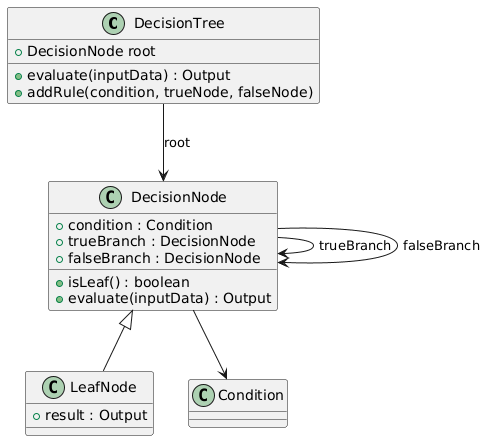

# Exam3-Capstone_Project_CIS044_MissionCollege

Problem Selected:
**Option D**: The Decision Engine (Trees)

Real-World Context: Loan approval systems, File Systems, or Game rendering.

The Problem: Organizing hierarchical data or executing complex logic rules.

Key Challenge: How does a bank automatically classify a loan applicant as "Approved" or "Rejected" based on attributes like income and credit score?

Required Structures: Binary Search Trees, Decision Trees, or Scene Graphs.
-----------------------------------------------------------------------------------------------------------
For Option D, real-world problems like automatically qualifying or rejecting loan applicants based on key attributing factors for the lender follow a structure of checking a condition, verifying its passage to the next condition, and then continuing this process until reaching a final outcome from the program. This type of problem  requires a data structure that evaluates the system of parameters quickly, allowing for modification of parameters and a clear execution path of the program. 

Hence, from this description, a tree follows this process of matching criteria to continue on to the next node to ultimately reach a final outcome from the branch of decision making. Now, between a decision tree and a binary search tree, a decision tree is the better choice for this problem because it is designed to represent a list of decisions based on parameters or conditions in the data. Unlike a binary search tree, which relies on sorted keys and is primarily used for efficient searching, a decision tree allows each branch to represent a different criteria, enabling more flexible logic and multiple decision pathways

Otherwise, I selected Option D as I found this the most interesting project out of the four to analyze and find a solution for.

**See UML Diagram in "Exam3_UMLDiagram"**

**Big-O Expectations**
    My Big-O expectations for this project is expected to be O(log n) because I plan to design my program in such a way that the tree is balanced which then eliminates half the remaining tree per decision. In general, the decision tree is efficient because each decision follows through one direct path without the need to backtrack. However, in worst-case scenarios, such as unbalanced trees, the expected time complexity would be O(n), provided that my balanced tree design is somehow compromised in the program. 
